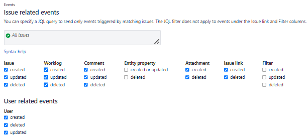

Webhook
^^^^^^^

Créer un fichier webhook.ts dans le src qui contiendra : 

.. code-block:: typescript

    import express from "express";
    import bodyParser from "body-parser";
    import { createLogger } from "./logger";

    const logger = createLogger();
    const app = express();
    app.use(bodyParser.json());
    // Définir l'URL pour le webhook
    const webhookUrl = "/";

    // Définir le gestionnaire de route pour le webhook
    app.post(webhookUrl, (req, res) => {
    // console.log("Requête reçue depuis le webhook : ", req.body);
    logger.info("Updated Jira issue", req.body);
    res.status(200).send("Webhook reçu avec succès !");
    });

    // Démarrer le serveur
    app.listen(3000, () => {
    console.log("Serveur démarré sur le port 3000");
    });

Créer un autre fichier logger.ts avec ce code:

.. code-block:: typescript

    import winston from "winston";

    export function createLogger() {
    return winston.createLogger({
        level: "info",
        format: winston.format.json(),
        transports: [
        new winston.transports.Console(),
        new winston.transports.File({ filename: "jira.json" }),
        ],
    });
    }

lancer, pour build tous les fichiers

.. code-block:: typescript

    npm run build

lancer

.. code-block:: typescript

    node ./build/webhook.js 

Pour lancer le serveur d'écoute, on recevra des données.

Cela créera un fichier json qui contiendra la réponse du webhook.

Et avec l'extension "Paste json as code"  copier tout le fichier json créé.

Créer un autre fichier .ts et faire Ctrl + Shift + p et enter, cela transformera le contenu du fichier json en un template .ts.

Refaire cela pour plusieurs commandes : worklog, issue, comment, attachement, issue link.

Dans le webhook, changer le post pour qu'il ressemble à ça : 

.. code-block:: typescript

    app.post(webhookUrl, (req, res) => {
    // console.log("Requête reçue depuis le webhook : ", req.body);
    switch (req.body.webhookEvent) {
        case "worklog_created": {
        logger.info("Worklog created : " + req.body.worklog.timeSpentSeconds);
        break;
        }
        case "worklog_updated": {
        logger.info("Worklog updated : " + req.body.worklog.timeSpentSeconds);
        break;
        }
        case "worklog_deleted": {
        logger.info("Worklog deleted : " + req.body.worklog.timeSpentSeconds);
        break;
        }
        case "jira:issue_created": {
        logger.info("issue created: " + req.body.issue.id);
        break;
        }
        case "jira:issue_udpated": {
        logger.info("issue udpated: " + req.body.issue.id);
        break;
        }
        case "jira:issue_deleted": {
        logger.info("issue deleted: " + req.body.issue.id);
        break;
        }
        case "comment_created": {
        logger.info("comment created: " + req.body.comment.body);
        break;
        }
        case "comment_udpated": {
        logger.info("comment udpated: " + req.body.comment.body);
        break;
        }
        case "comment_deleted": {
        logger.info("comment deleted: " + req.body.comment.body);
        break;
        }
        case "attachement_created": {
        logger.info("atatchement created : " + req.body.attachment.filename);
        break;
        }
        case "attachement_updated": {
        logger.info("atatchement updated : " + req.body.attachment.filename);
        break;
        }
        case "attachement_deleted": {
        logger.info("atatchement deleted : " + req.body.attachment.filename);
        break;
        }
    }

    res.status(200).send("Webhook reçu avec succès !");
    });

| Ces switch/case permettront d'afficher une notification qui donnera des informations par rapport à la réponse du webhook.
| Pour configurer les events auxquels le webhook va réagir sur Jira:

- il faut d'abord se rendre sur Jira
- Aller dans les "Settings" et cliquer sur "System"
- Utiliser la bare de recherche "Jira admin" et chercher le mot "WebHooks".
- Cliquer sur le bouton "Create a WebHook"
- Remplir les informations suivantes : Name = nom du webhook, URL = adresse publique généré par ngrok, et choisir les types d'events auxquels le webhook va réagir.
- Ici les events choisis sont les suivants:

