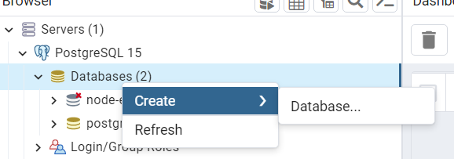
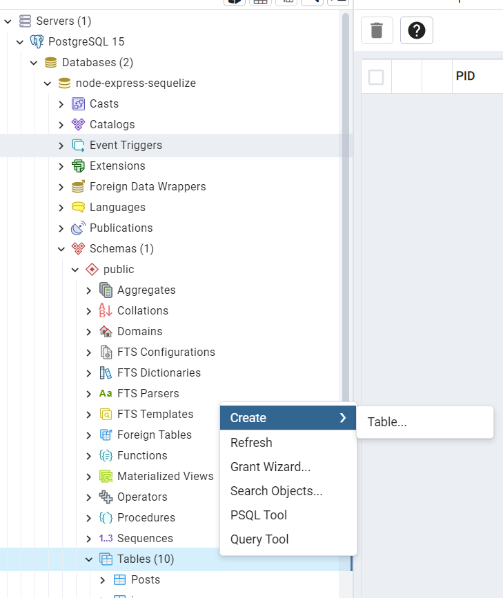
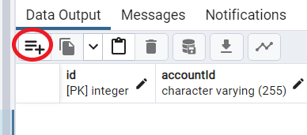

.. include:: ../_static/references/_sphinx.rst

Documentation base de donnée
=============================

Configuration base de donnée
^^^^^^^^^^^^^^^^^^^^^^^^^^^^

- Installer progreSQL : `postgresql`_

- ouvrir "pgadmin 4"

- y configurer le mot de passe et le nom d'utilisateur.

- Pour créer une base de donnée,

- dans la base de données, pour créer une table,

- pour voir le contenu de la table,

- dans la table pour ajouter une ligne,

- dans la table, pour actualiser les changements.

Configuration dans le backend
^^^^^^^^^^^^^^^^^^^^^^^^^^^^^

Dans le fichier server.js ajouter:

.. code-block:: javascript

    const db = require("./app/models");
    db.sequelize.sync();
    // // drop the table if it already exists
    // db.sequelize.sync({ force: true }).then(() => {
    //   console.log("Drop and re-sync db.");
    // });

décommenter les lignes afin d'avoir l'option qui supprime la table si elle existe déjà.

cela permet de faire le lien entre la base de données et le serveur express du backend.

créer un fichier "index.js" dans un dossier "models", qui fera le lien entre la base de données et le backend, avec sequelize, celui contiendra:

.. code-block:: javascript

    const dbConfig = require("../config/db.config.js");
    const Sequelize = require("sequelize");

    const sequelize = new Sequelize(dbConfig.DB, dbConfig.USER, dbConfig.PASSWORD, {
    host: dbConfig.HOST,
    dialect: dbConfig.dialect,

    pool: {
        max: dbConfig.pool.max,
        min: dbConfig.pool.min,
        acquire: dbConfig.pool.acquire,
        idle: dbConfig.pool.idle
    }
    });

    const db = {};

    db.Sequelize = Sequelize;
    db.sequelize = sequelize;

    //exemple:
    db.tutorials = require("./tutorial.model.js")(sequelize, Sequelize);

    module.exports = db;

Ci-dessus, il y a un exemple d'utilisation de la base de données, tutorials est une table créée dans la base de données, 

elle utilise un datamodel spécifié par le fichier "tutorial.model.js" qui se définit comme suit:

.. code-block:: javascript

    module.exports = (sequelize, Sequelize) => {
    const Tutorial = sequelize.define("tutorial", {
        title: {
        type: Sequelize.STRING
        },
        description: {
        type: Sequelize.STRING
        },
        published: {
        type: Sequelize.BOOLEAN
        }
    });

    return Tutorial;
    };

chaque attribut sera considéré comme une colonne dans la table.

Il y a enfin un import du fichier "db.config.js" contenu dans le dossier "config", qui permet de faire la connection à la base de donnée:

.. code-block:: javascript

    module.exports = {
    HOST: "localhost",
    USER: "postgres",
    PASSWORD: "INSERER MOT DE PASSE",
    DB: "node-express-sequelize",
    dialect: "postgres",
    pool: {
        max: 5,
        min: 0,
        acquire: 30000,
        idle: 10000
    }
    };