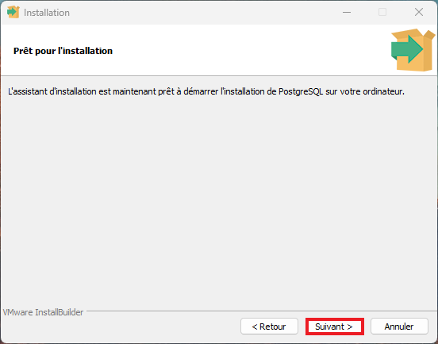

.. include:: ../_static/references/_sphinx.rst

Database
==========

To install the database open this link: `postgresql`_

After installing the installer, open it and this is what you will see:

Click on Next/suivant

by default all are selected but if you don't want some, unmark them

.. image:: ../_static/images/instrep.png
    :width: 300

Click on Next/suivant if you choose default configuration

.. image:: ../_static/images/instrepdata.png
    :width: 300

Click on Next/suivant if you choose default configuration

choose a password for the database

you should let the default port and click on Next/suivant

choose the language for the database

Click on Next/suivant 

Click on Next/suivant 

wait for the installation to finish

choose if you want to unmark and then click on Finish.

You have installed postgresql !  To open and configure see the documentation :doc:`../Database/Database`